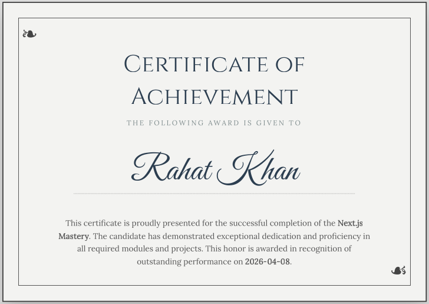

# 🎓 Bulk Certificate Generation System
### Automated PDF Engine using NestJS, Prisma & Puppeteer

---

## 📌 Overview
This project addresses the challenge of manually creating hundreds of certificates for educational institutes. It provides a robust backend solution to transform raw student data from CSV files into high-quality, print-ready PDF certificates using dynamic HTML templates.

 

 

## 🚀 Key Features
* **Dynamic Templating:** Supports `{{placeholder}}` logic where HTML templates are automatically populated with CSV data.
* **High-Fidelity PDF:** Leverages **Puppeteer** (Headless Chrome) to ensure the PDF looks exactly like the HTML/CSS design.
* **Bulk Processing:** Efficiently handles large CSV uploads and maps columns (Name, Date, Course) to the corresponding template fields.
* **Scalable Architecture:** Built with **NestJS** for modularity and **Prisma ORM** for reliable PostgreSQL data management.

## 🛠 Tech Stack
* **Backend:** NestJS (Node.js Framework)
* **Database:** PostgreSQL (Neon)
* **ORM:** Prisma 5
* **PDF Engine:** Puppeteer
* **Data Handling:** `csv-parse` for stream processing

## 🧪 Test Case: Generation Workflow
To verify the system's accuracy, the following test scenario is used:

### 1. Input Template
A Classic Achievement Certificate with placeholders for `{{name}}`, `{{course}}`, and `{{date}}`.

### 2. Input Data (`test.csv`)
| name | course | date |
| :--- | :--- | :--- |
| Marceline Anderson | Advanced Web Development | April 09, 2026 |
| John Doe | UI/UX Design Mastery | April 10, 2026 |

### 3. Expected Result
* The system generates unique PDF files in the `/static/certificates` directory.
* Each PDF maintains professional CSS styling, custom fonts, and accurate data mapping.
* API returns a `201 Created` status with the download links for the generated files.

